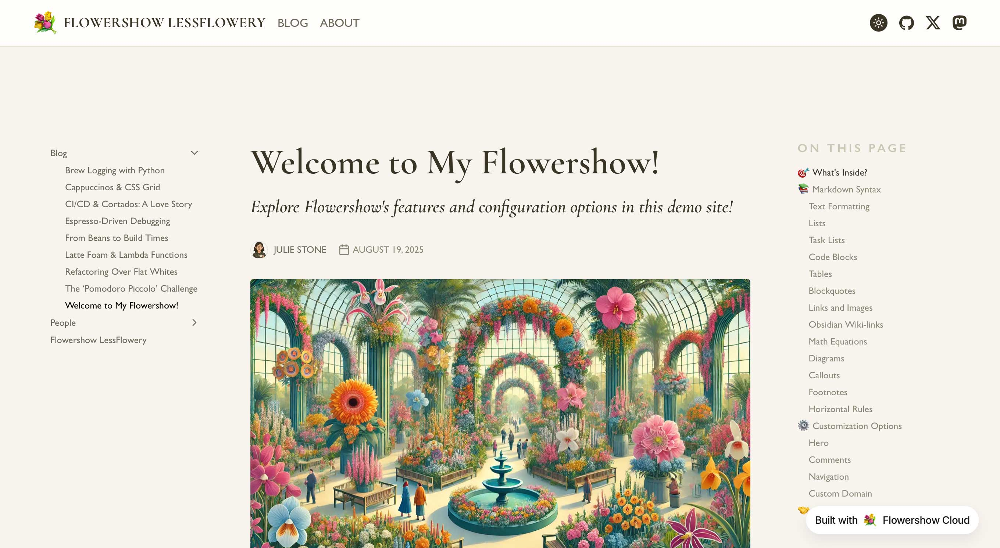
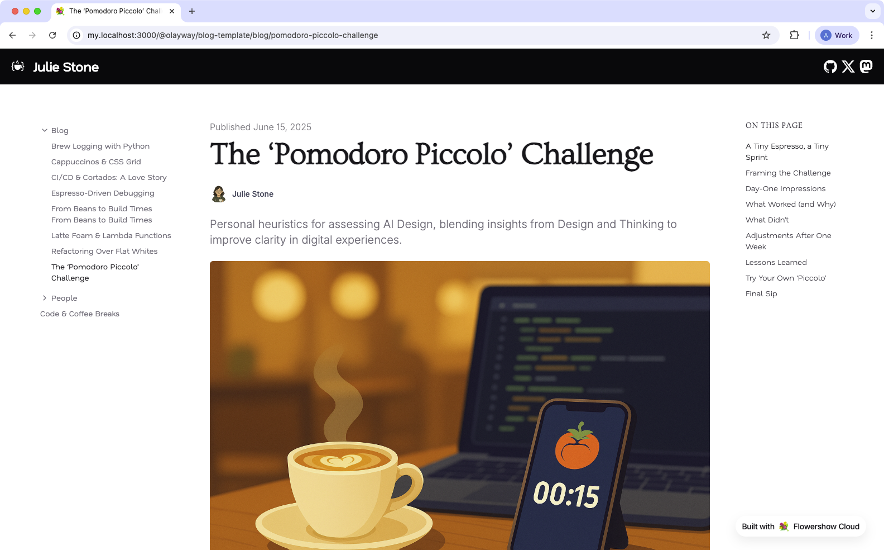
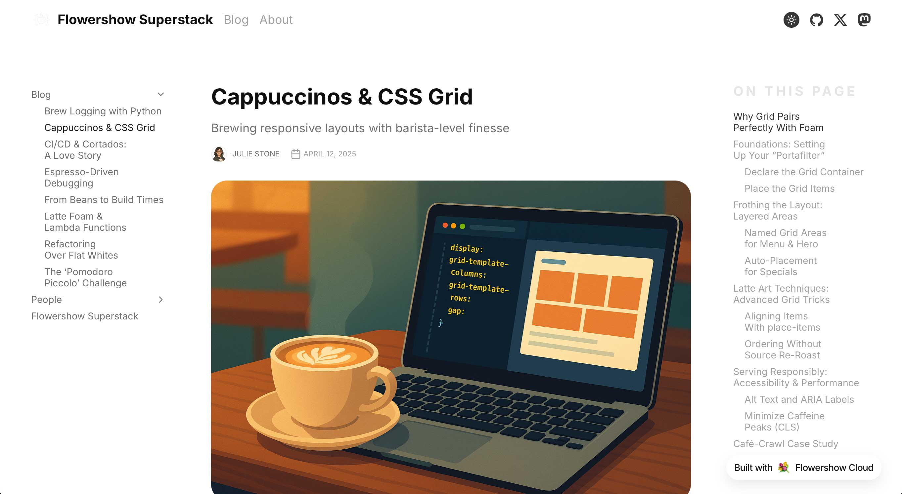
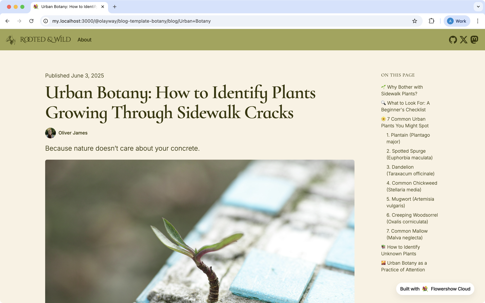

# Official Flowershow Themes 💐

Official collection of themes for [Flowershow](https://flowershow.app) websites.

## Available Themes

### LessFlowery



[👀 Demo](https://lessflowery.flowershow.app/)

Inspired by the visual style of LessWrong https://www.lesswrong.com/

### Letterpress

A clean, modern theme with balanced typography and whitespace.



[👀 Demo](https://letterpress.flowershow.app/)

Inspired by the visual style of "Glide" Ghost theme https://ghost.org/themes/glide/

### Superstack



[👀 Demo](https://superstack.flowershow.app/)

Inspired by the visual style of Substack.

### Leaf

A nature-inspired theme with subtle green colors.



[👀 Demo](https://leaf.flowershow.app/)


## Usage

You can use Flowershow themes by configuring them in your site's `config.json` file. There are several ways to use a theme:

### 1. Use Latest Version of an Official Theme

```json
{
  "theme": "letterpress"
}
```

### 2. Use a Specific Version of an Official Theme

```json
{
  "theme": "letterpress@0.0.2"
}
```

## Theme Development

### Structure

Each theme should be in its own directory with the following structure:

```
theme-name/
├── theme.css      # Theme CSS file
└── preview.png    # Theme preview image
```

### Guidelines

1. **Semantic Versioning**: Use MAJOR.MINOR.PATCH versioning scheme
   - MAJOR: Breaking changes
   - MINOR: New features, no breaking changes
   - PATCH: Bug fixes, no breaking changes

2. **Git Tags**: Tag all releases (e.g., v1.2.0)

3. **Documentation**: Update CHANGELOG.md with all notable changes

### CSS Best Practices

- Use semantic class names
- Ensure responsive design
- Test across major browsers

### Theme Distribution

Official themes are distributed through jsDelivr CDN, which provides:

- Global CDN distribution
- Version pinning
- High availability
- No rate limits
- Automatic GitHub integration

## Contributing

We welcome contributions! Here's how you can contribute:

1. Fork the repository
2. Create a new branch for your theme
3. Add your theme following the structure above
4. Add preview images
5. Test your theme with different content types
6. Submit a pull request

## License

MIT License - feel free to use in your own projects.
